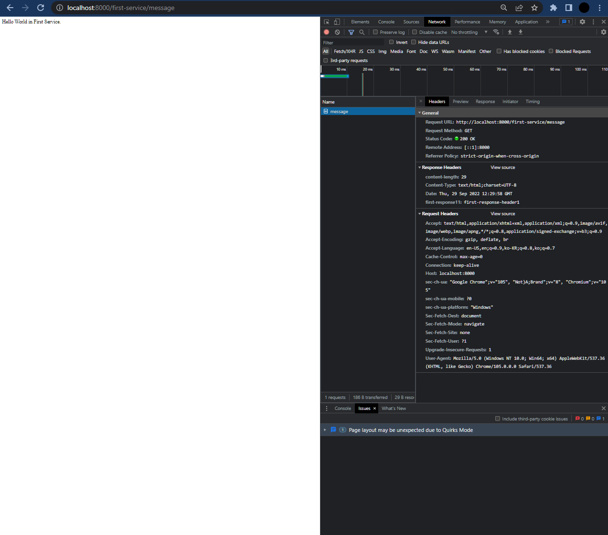
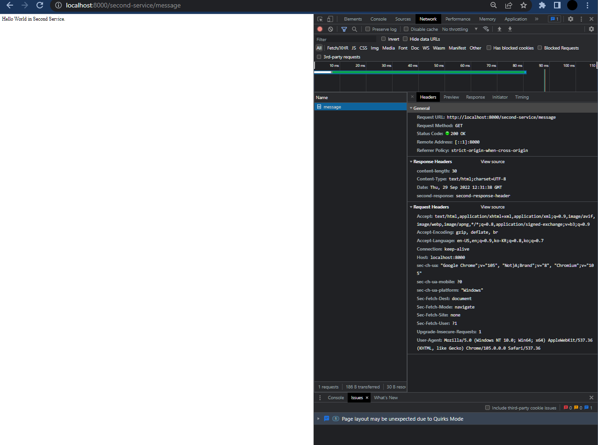
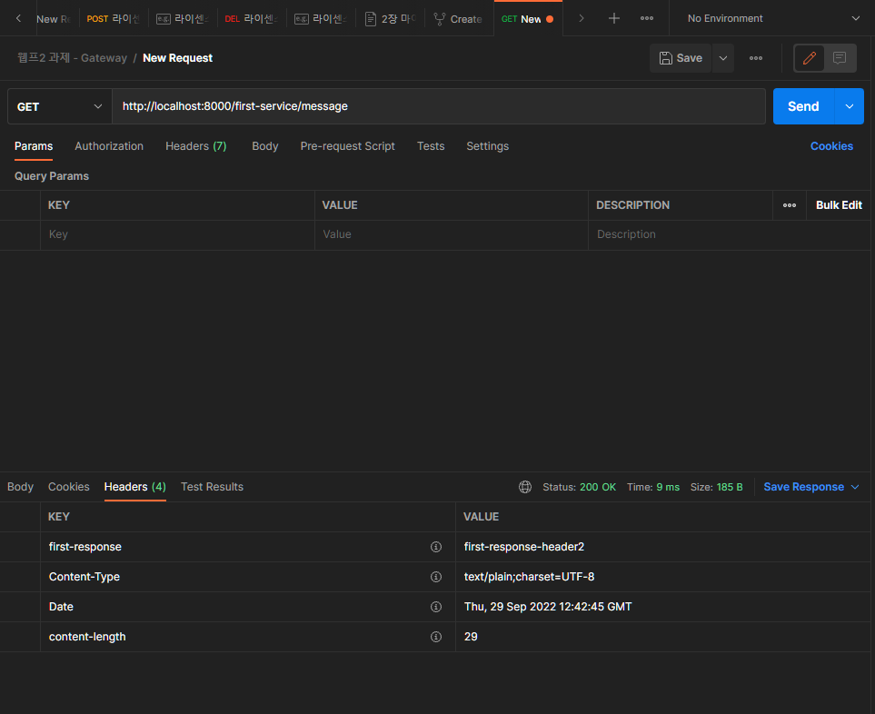
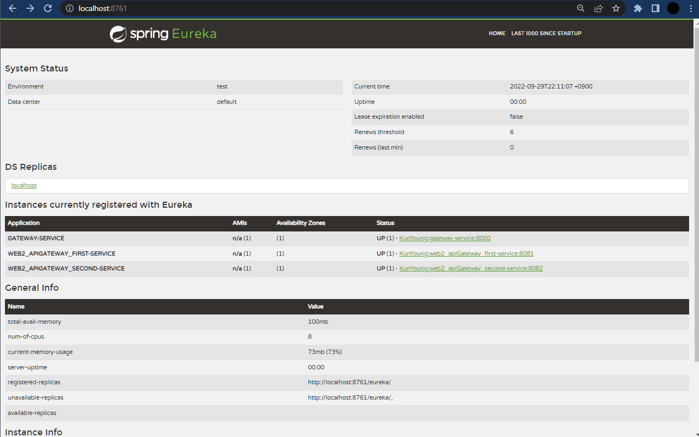

## ⭐ LAB - Filter 구현

<br/>

#### 📑 Gateway service 클래스 파일 수정

```yaml
server:
  port: 8000

eureka:
  client:
    register-with-eureka: false
    fetch-registry: false
    service-url:
        defaultZone: http://localhost:8761/eureka/
spring:
  application:
    name: gateway-service
#  cloud:
#    gateway:
#      routes:
#        - id: first-service
#          uri: http://localhost:8081
#          predicates:
#            - Path=/first-service/**
#        - id: second-service
#          uri: http://localhost:8082
#          predicates:
#            - Path=/second-service/**
```

<br/>

#### 📑 FilterConfig 클래스 생성 및 설정

```java
package com.example.web2_apigateway_gatewayservice.config;

import org.springframework.cloud.gateway.route.RouteLocator;
import org.springframework.cloud.gateway.route.builder.RouteLocatorBuilder;
import org.springframework.context.annotation.Bean;
import org.springframework.context.annotation.Configuration;

@Configuration
public class FilterConfig {

    @Bean
    public RouteLocator gatewayRoutes(RouteLocatorBuilder builder) {
        return builder.routes()
                .route(r -> r.path("/first-service/**")
                        .filters(f -> f.addRequestHeader("first-request", "first-request-header")
                                .addResponseHeader("first-response11", "first-response-header1"))
                        .uri("http://localhost:8081/"))
                .route(r -> r.path("/second-service/**")
                        .filters(f -> f.addRequestHeader("second-request", "second-request-header")
                                .addResponseHeader("second-response", "second-response-header"))
                        .uri("http://localhost:8082/"))
                .build();
    }
}
```

<br/>

### ✔ http://localhost:8000/first-service/message 요청



<br/>

### ✔ http://localhost:8000/second-service/message 요청



<br/>
<br/>
<br/>

## ⭐ LAB - Filter 구현


<br/>

#### 📑 FilterConfig에서 Annotaion 주석 처리

```java
package com.example.web2_apigateway_gatewayservice.config;

import org.springframework.cloud.gateway.route.RouteLocator;
import org.springframework.cloud.gateway.route.builder.RouteLocatorBuilder;
import org.springframework.context.annotation.Bean;
import org.springframework.context.annotation.Configuration;

//@Configuration
public class FilterConfig {

//    @Bean
    public RouteLocator gatewayRoutes(RouteLocatorBuilder builder) {
        return builder.routes()
                .route(r -> r.path("/first-service/**")
                        .filters(f -> f.addRequestHeader("first-request", "first-request-header")
                                .addResponseHeader("first-response11", "first-response-header1"))
                        .uri("http://localhost:8081/"))
                .route(r -> r.path("/second-service/**")
                        .filters(f -> f.addRequestHeader("second-request", "second-request-header")
                                .addResponseHeader("second-response", "second-response-header"))
                        .uri("http://localhost:8082/"))
                .build();
    }
}
```


<br/>

#### 📑 yml 파일에서 주석 제거

```yaml
server:
  port: 8000

eureka:
  client:
    register-with-eureka: false
    fetch-registry: false
    service-url:
        defaultZone: http://localhost:8761/eureka/
spring:
  application:
    name: gateway-service
  cloud:
    gateway:
      routes:
        - id: first-service
          uri: http://localhost:8081
          predicates:
            - Path=/first-service/**
        - id: second-service
          uri: http://localhost:8082
          predicates:
            - Path=/second-service/**
```

<br/>

#### 📑 yml 파일 필터 추가

```yaml
server:
  port: 8000

eureka:
  client:
    register-with-eureka: false
    fetch-registry: false
    service-url:
        defaultZone: http://localhost:8761/eureka/
spring:
  application:
    name: gateway-service
  cloud:
    gateway:
      routes:
        - id: first-service
          uri: http://localhost:8081
          predicates:
            - Path=/first-service/**
          filters:
            - AddRequestHeader=first-request, first-request-header2
            - AddResponseHeader=first-response, first-response-header2
        - id: second-service
          uri: http://localhost:8082
          predicates:
            - Path=/second-service/**
          filters:
            - AddRequestHeader=second-request, second-request-header2
            - AddResponseHeader=second-response, second-response-header2
```

<br/>

#### 📑 테스트




<br/>
<br/>
<br/>

## ⭐ Spring Cloud Gateway - Eureka 연동

<br/>

#### 📑 Eureka Client 추가

- pom.xml
```xml
 <!-- https://mvnrepository.com/artifact/org.springframework.cloud/spring-cloud-starter-netflix-eureka-client -->
<dependency>
    <groupId>org.springframework.cloud</groupId>
    <artifactId>spring-cloud-starter-netflix-eureka-client</artifactId>
    <version>3.1.3</version>
</dependency>
```

<br/>

- application.yml
```yaml
eureka:
  client:
    register-with-eureka: true
    fetch-registry: true
    service-url:
        defaultZone: http://localhost:8761/eureka/
```


<br/>

#### 📑 Eureka Client 추가 at (Spring Cloud Gateway, First Service, Second Service) - application.yml

```yaml
server:
  port: 8000

eureka:
  client:
    register-with-eureka: true
    fetch-registry: true
    service-url:
      defaultZone: http://localhost:8761/eureka/
spring:
  application:
    name: gateway-service
  cloud:
    gateway:
      routes:
        - id: first-service
          uri: lb://web2_apiGateway_first-service
          predicates:
            - Path=/first-service/**
          filters:
            - AddRequestHeader=first-request, first-request-header2
            - AddResponseHeader=first-response, first-response-header2
        - id: second-service
          uri: lb://web2_apiGateway_second-service
          predicates:
            - Path=/second-service/**
          filters:
            - AddRequestHeader=second-request, second-request-header2
            - AddResponseHeader=second-response, second-response-header2
```


<br/>

#### 📑 Eureka Server -Service 등록 확인




